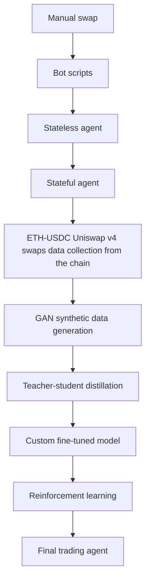

# Web3 AI trading agent—hands-on walkthrough

The chapters in this README follow the YouTube video walkthrough: [Build an Autonomous Web3 AI Trading Agent](https://youtu.be/2wQn_nvAQp8).

See also [Chainstack Developer Portal](https://docs.chainstack.com/docs/mastering-web3-llms-and-ai-use).

And [sign up with Chainstack](http://console.chainstack.com/) for the best Web3 infrastructure & RPC nodes.

⚠️ NOT FOR PRODUCTION: This code is for learning purposes only. We assume no responsibility for the code or its usage. Modify for your needs and learn from it—examples, issues, and PRs all contain valuable insights.

## Overview

This project builds a Web3 AI trading agent that operates on the ETH-USDC pair on BASE blockchain using Uniswap V4. The tutorial follows the progression from manual trades to fully autonomous AI agents with custom fine-tuned models.

This is a 'the hard way' type of project seeking to get your hands deep into the full Web3 AI trading agent pipeline.

### A few key things:
- **Local-first approach**: As much as possible runs on your machine
- **Web3 native**: Direct blockchain interaction, no abstractions
- **Custom AI models**: Fine tune your own trading models based on real or synthetic data
- **Advanced techniques**: GANs, teacher-student distillation, reinforcement learning
- **Transparent and secure**: You control every component

---

## Table of contents

1. [**Stack**](#chapter-the-stack) - Technology stack overview and setup
2. [**Pipeline**](#chapter-the-pipeline) - Development pipeline architecture overview
3. [**Implementation**](#chapter-the-implementation) - Environment setup and manual/automated swaps
4. [**Stateless agent**](#chapter-stateless-agent) - Basic AI trading agent without memory
5. [**Stateful agent**](#chapter-stateful-agent) - Memory-enabled agent with learning capabilities
6. [**Interlude & your own model**](#chapter-interlude--your-own-model) - Fine-tuning methodology overview
7. [**Generative adversarial networks (GANs) & synthetic data**](#chapter-generative-adversarial-networks--synthetic-data) - GAN-based synthetic data generation
8. [**Teacher to student distillation**](#chapter-teacher-to-student-distillation) - Knowledge transfer from large to small models
9. [**Fuse the LoRA delta & convert to Ollama**](#chapter-fuse-the-lora-delta--convert-to-ollama) - Model deployment options
10. [**Reinforcement learning**](#chapter-reinforcement-learning) - RL-enhanced trading strategies

### Reference
- [**Project structure**](#project-structure) - Complete codebase organization
- [**Resources**](#resources) - Documentation, APIs, and research papers

---

## CHAPTER: THE STACK

This chapter outlines the complete technology stack for building a Web3 AI trading agent. We prioritize local-first development, giving you full control over your infrastructure while maintaining the security and transparency that Web3 developers expect.

### Hardware requirements

The recommended setup provides optimal performance for machine learning workflows while keeping everything local:

- **MacBook Pro M3 Pro with 18GB RAM** — optimal for Apple MLX-LM training and inference. That's my machine, so feel free to experiment.
- **Alternative hardware** — any machine with adequate GPU support and at least 16GB RAM. You may want to swap MLX-LM to Unsloth if you are not going with Mac hardware.

The MacBook M3 configuration offers several advantages for this project. The unified memory architecture efficiently handles large language models, while the Metal Performance Shaders (MPS) acceleration provides fast training times for our GANs and LoRA fine-tuning.

For non-Apple hardware, ensure your system has sufficient VRAM (8GB minimum) for local model inference and training. You can substitute MLX-LM with alternatives like [Unsloth](https://unsloth.ai/).

### Technology stack overview

The stack follows Web3 principles of local execution & control. As many components as possible run on your machine, with minimal external dependencies.

#### Blockchain infrastructure

**BASE blockchain**  
[BASE](https://base.org/) serves as our Layer 2 execution environment. Deployed & maintained by Coinbase, BASE offers low transaction costs and high throughput, making it ideal for frequent trading operations. The network's EVM compatibility ensures seamless integration with existing Ethereum tooling.

**Uniswap V4**  
[Uniswap V4](https://docs.uniswap.org/contracts/v4/) is the latest evolution in automated market makers (AMM) and the [singleton contract architecture](https://docs.uniswap.org/contracts/v4/concepts/v4-vs-v3).

If you are a Web3 user or developer and familiar with V3, the singleton design means that we are going to use the pool ID for token pairs instead of a typical separate V3 pool contract.

**Foundry development framework**  
[Foundry](https://book.getfoundry.sh/) provides our local blockchain development environment. We use Foundry to fork BASE mainnet, creating a local testing environment with real market data, top up our address if necessary with paper ETH.  This approach lets you:

- Test strategies without spending real funds, aka paper trade
- Reproduce exact on-chain conditions
- Debug transactions with detailed tracing if necessary

**Chainstack nodes**  
[Chainstack](https://chainstack.com/) delivers enterprise-grade [BASE RPC endpoints](https://chainstack.com/build-better-with-base/):

- Sub-second response times for real-time trading
- 99.99% uptime for critical operations
- Dedicated nodes for consistent performance
- Global edge locations for minimal latency

#### AI/LLM stack

**Apple MLX-LM**  
[MLX-LM](https://github.com/ml-explore/mlx-lm) is Apple's machine learning framework optimized for Apple Silicon. MLX-LM handles our LoRA fine-tuning with memory-efficient implementations designed for unified memory architectures.

Key benefits include:
- Native Apple Silicon optimization
- Memory-efficient training algorithms
- Seamless integration with Hugging Face models
- Support for quantized model inference

**Ollama local inference**  
[Ollama](https://ollama.com/) manages local large language model inference. Ollama provides a simple API for running models locally without external dependencies. This ensures:

- Complete data privacy
- Zero API costs for inference
- Offline operation capability
- Consistent response times

**Gymnasium reinforcement learning**  
[Gymnasium](https://gymnasium.farama.org/) (formerly OpenAI Gym) provides our reinforcement learning environment. We use Gymnasium to create custom trading environments that simulate market conditions and reward profitable strategies.

**PyTorch neural networks**  
[PyTorch](https://pytorch.org/) powers our generative adversarial networks for synthetic data generation. PyTorch's dynamic computation graphs make it pretty good for experimenting with GAN architectures and training procedures.

#### Models

Our model pipeline uses a teacher-student approach with progressively smaller, more specialized models:

**Fin-R1**  
Fin-R1 is a financial domain-specific model based on DeepSeek-R1 architecture. Pre-trained on financial data, Fin-R1 provides sophisticated reasoning about market conditions and trading strategies.

**QwQ 32B (Distillation teacher)**  
QwQ serves as our distillation teacher via OpenRouter. With 32 billion parameters, QwQ provides detailed reasoning that we compress into smaller, more efficient models. <- I can't reasonably run this on my MacBook Pro M3 Pro 18 GB RAM, so I'm using [OpenRouter](https://openrouter.ai/) to run the QwQ 32B model.

**Qwen 2.5 3B (Student model)**  
Qwen 2.5 3B serves as our trainable student model. This 3-billion parameter model runs efficiently on consumer hardware while maintaining strong performance after fine-tuning.

Remember that there are almost 2 million models on [Hugging Face](https://huggingface.co/models) and new models are published daily, so shop around and experiment.

### Installation and setup

Follow these steps to prepare your development environment. Each step builds upon the previous one, so complete them in order.

#### 1. Repository setup

Clone the project repository and navigate to the project directory:

```bash
git clone https://github.com/chainstacklabs/web3-ai-trading-agent.git
cd ai_trading_agent_publish_repo
```

#### 2. Python environment

Install the required Python dependencies. The requirements include all necessary packages for blockchain interaction, machine learning, and data processing:

```bash
pip install -r requirements.txt
```

The requirements.txt includes:
- **Web3 libraries** — [web3.py](https://pypi.org/project/web3/), [eth-abi](https://pypi.org/project/eth-abi/), [eth-account](https://pypi.org/project/eth-account/), [uniswap-universal-router-decoder](https://pypi.org/project/uniswap-universal-router-decoder/) for blockchain interaction
- **ML frameworks** — [torch](https://pypi.org/project/torch/), [mlx](https://pypi.org/project/mlx/), [mlx-lm](https://pypi.org/project/mlx-lm/) for model training
- **Data processing** — pandas, numpy for data manipulation
- **Reinforcement learning** — gymnasium, stable-baselines3 for RL training

#### 3. Foundry installation

Install Foundry for blockchain development and testing:

```bash
curl -L https://foundry.paradigm.xyz | bash
foundryup
```

Foundry installation includes:
- **anvil** — local Ethereum node for testing
- **forge** — smart contract compilation and testing
- **cast** — command-line tool for blockchain interaction

You can also checkout the Chainstack Developer Portal: [BASE tooling](https://docs.chainstack.com/docs/base-tooling#foundry) for an entry on Foundry with Chainstack nodes.

#### 4. Ollama setup

[Downnload & install Ollama](https://ollama.com/download) for local model inference.

Check Ollama help:

```bash
ollama help
```

Example of checking the local model card (llm details):

```bash
% ollama list
NAME                                ID              SIZE      MODIFIED       
hf.co/Mungert/Fin-R1-GGUF:latest    5050b9253527    4.7 GB    22 seconds ago    
% ollama show hf.co/Mungert/Fin-R1-GGUF:latest
  Model
    architecture        qwen2      
    parameters          7.6B       
    context length      32768      
    embedding length    3584       
    quantization        unknown    

  Capabilities
    completion    
    tools         
    insert        
```

#### 5. Model downloads

Download the language models you want to serve through Ollama to the agent.

For example, the [Fin-R1 model](https://huggingface.co/Mungert/Fin-R1-GGUF):

```bash
ollama pull hf.co/Mungert/Fin-R1-GGUF
```

Also check out the [Ollama library](https://ollama.com/library) for ready-to-run models.

For example, the [Qwen 2.5:3B model](https://ollama.com/library/qwen2.5:3b)

```bash
ollama pull qwen2.5:3b
```

In general, again, I encourage you to shop around on Hugging Face & Ollama and experiment. There are usually different [quantizations](https://www.youtube.com/watch?v=K75j8MkwgJ0) and community format conversions of the same model. 

Examples (that get outdated very quickly in this space):

- **Fin-R1** — specialized for financial analysis and trading decisions
- **Qwen 2.5 3B** — lightweight model suitable for fine-tuning
- **Phi4 14B** — balanced performance and resource requirements <- hogs my MacBook Pro M3 Pro 18 GB RAM quite a bit; for your reference on billions of parameters numbers

### Environment verification

Verify your installation by checking each component:

Check Python dependencies:

```bash
python -c "import web3, torch, mlx, mlx_lm, uniswap_universal_router_decoder; print('Dependencies installed successfully')"
```

Verify Foundry installation:

```bash
anvil --version
```

Confirm Ollama is running:

```bash
curl http://localhost:11434/api/version
```

List available models:

```bash
ollama list
```

Your environment is ready when all commands execute without errors and return expected output.

### Configuration overview

The project uses a centralized configuration system in `config.py`. Key configuration areas include:

- **RPC endpoints** — Chainstack BASE node connections
- **Model settings** — Ollama and MLX model specifications  
- **Trading parameters** — rebalancing thresholds and intervals
- **Security settings** — private keys and API credentials <- Remember that this a NOT FOR PRODUCTION tutorial. In a production deployment, don't store your private key in a config.py file.

We'll configure these settings in detail in the implementation chapter.

---

## CHAPTER: THE PIPELINE
*This is the pipeline overview with little to no hands-on. If you are looking to get your feet wet, feel free to skip this chapter.*

This chapter maps out our complete development pipeline, tracing the evolution from manual trading to autonomous AI agents. Our approach mirrors the broader Web3 industry progression while giving you hands-on experience with each technological advancement.

### The three-stage evolution

Our tutorial follows the natural progression of Web3 trading, letting you experience how the industry evolved from manual interactions to scripted bots to an LLM agent.

#### Stage 1: Manual trading era
**Direct MetaMask interactions**

This one might be of interest to you likely only if you've never done a swap on blockchain before. Otherwise feel free to skip this section.

The foundation of Web3 trading begins with manual transactions. Users connect their wallets directly to decentralized exchanges, manually selecting trading pairs, amounts, and executing transactions.

To do a manual ETH-USDC swap on the exact Uniswap V4 pool that we use in a bot script and in the trading agent later in the tutorial, do the following:

1. Install [MetaMask](https://metamask.io/).
2. Connect to the BASE mainnet. See [Chainstack tooling](https://docs.chainstack.com/docs/base-tooling#metamask) or use [Chainlist](https://chainlist.org/).
3. Get some ETH on your BASE account.
4. Do the [ETH-USDC pool](https://app.uniswap.org/explore/pools/base/0x96d4b53a38337a5733179751781178a2613306063c511b78cd02684739288c0a) swap.

#### Stage 2: Bot automation era
**Programmatic ETH-USDC swaps**

The DeFi summer of 2020 sparked widespread adoption of trading bots. Developers began automating repetitive tasks, leading to the MEV (maximum extractable value) revolution.

Make sure you have the private key and the RPC node endpoints set up in the `config.py` file. And then run the `usdc_to_eth_swap.py` and `eth_to_usdc_swap.py` respectively to get the Uniswap V4 programmatic swap experience.

Bot scripts excel at executing predefined strategies but lack adaptability to changing market conditions.

#### Stage 3: AI agent era
**Intelligent decision-making systems**

The current frontier combines traditional Web3 infrastructure with artificial intelligence. AI agents analyze market data, adapt to changing conditions, and execute complex strategies autonomously.

### Development pipeline architecture

Our pipeline progresses through increasingly sophisticated implementations, each building upon previous foundations.



### Pipeline breakdown

Each stage in our pipeline serves a specific learning objective while building toward the final autonomous trading system.

#### Foundation: Manual swap implementation
**Learning objective:** Understand basic Uniswap V4 mechanics

You'll start by executing ETH-USDC swaps manually through MetaMask, then replicate the same operations programmatically.

#### Level 1: Bot script automation
**Learning objective:** Script a bot to do one-off ETH<>USDC swaps

Transform manual operations into automated scripts that execute swaps based on predefined rules.

#### Level 2: Stateless AI agent
**Learning objective:** Integrate AI decision making

Replace static rules with dynamic AI-driven decisions using local language models. The stateless agent:

- Queries Ollama models for trading decisions
- Processes real-time market data
- Executes trades based on AI recommendations
- Operates without memory between decisions

#### Level 3: Stateful AI agent  
**Learning objective:** Add memory and context management

Enhance the agent with persistent memory and strategy tracking. The stateful agent:

- Maintains trading history and performance metrics
- Tracks long-term strategy effectiveness
- Manages context window limitations
- Summarizes performance when memory fills up

#### Level 4: Data collection and processing
**Learning objective:** Collect raw Uniswap V4 data and prepare for synthetic data generation

Collect real on-chain data from BASE mainnet to fine tune custom models:

- Historical swap event extraction
- Data preprocessing for synthetic data generation

#### Level 5: Synthetic data generation
**Learning objective:** Create enhanced training datasets

Use generative adversarial networks (GANs) to create synthetic trading data:

- Inspired by [Generative Adversarial Neural Networks for Realistic Stock Market Simulations](https://thesai.org/Downloads/Volume15No3/Paper_5-Generative_Adversarial_Neural_Networks.pdf)
- GAN architecture for time series data
- WGAN-GP training for stable convergence
- Data quality validation and verification

#### Level 6: Model distillation pipeline
**Learning objective:** Create custom trading models

Distill knowledge from large teacher models into efficient student models:

- [Chain of Draft](https://arxiv.org/abs/2502.18600) prompting for efficiency
- QwQ 32B teacher model via [OpenRouter](https://openrouter.ai/)
- Qwen 2.5 3B student model fine-tuning
- LoRA adaptation for parameter efficiency

#### Level 7: Reinforcement learning enhancement
**Learning objective:** Optimize strategies through trial and error

Stack reinforcement learning on top of supervised fine-tuning:

- Custom Gymnasium trading environment
- DQN (Deep Q-Network) strategy optimization
- Experience replay for stable learning
- Multi-layer fine-tuning

#### Final system: Autonomous trading agent
**Learning objective:** Deploy your trading system

Integrate all components into an autonomous trading system:

- Custom fine-tuned models with domain expertise
- Real-time market data processing
- Risk management and position sizing
- Performance monitoring and strategy adaptation

---

## CHAPTER: THE IMPLEMENTATION

This chapter guides you through implementing your first autonomous trading system on Uniswap V4. You'll learn the architectural fundamentals, configure your environment, and execute your first programmatic swaps on BASE blockchain using Chainstack infrastructure.

### Understanding Uniswap V4 architecture

Uniswap V4 represents a significant evolution from previous versions, introducing architectural changes that enable more efficient and flexible trading operations.

#### The singleton design pattern

Uniswap V4 uses a **singleton concept** that fundamentally changes how pools are managed:

**Single PoolManager contract**  
Unlike Uniswap V3 where each trading pair required a separate contract deployment, V4 consolidates all pool management into a single contract.

**Pool ID derivation system**  
Each pool receives a unique identifier derived from:

- **Token addresses** — the two tokens in the trading pair
- **Fee tier** — the fee percentage charged on swaps
- **Tick spacing** — granularity of price ranges for liquidity
- **Hooks address** — custom logic contract (if any; we filter out some custom deployments in `fetch_pool_stats.py` file like the Odos & 1inch routers)

For our ETH-USDC pool, the ID [0x96d4b53a38337a5733179751781178a2613306063c511b78cd02684739288c0a](https://app.uniswap.org/explore/pools/base/0x96d4b53a38337a5733179751781178a2613306063c511b78cd02684739288c0a) uniquely identifies this specific pool configuration.

**Universal Router integration**  
The Universal Router ([0x6ff5693b99212da76ad316178a184ab56d299b43](https://basescan.org/address/0x6ff5693b99212da76ad316178a184ab56d299b43#code)) aggregates the Uniswap V4 trading functionality.

Our implementation uses pools without custom hooks.

#### Contract interaction flow

Understanding the interaction flow helps debug issues (although there shouldn't be any):

1. **User initiates swap** — calls Universal Router with swap parameters
2. **Router validates inputs** — checks slippage, deadlines, and permissions
3. **PoolManager processes swap** — updates pool state and calculates outputs
4. **Token transfers execute** — moves tokens between user and pool
5. **Events emit** — on-chain logs for tracking and analytics

### Environment configuration

Proper configuration ensures secure and reliable operation of your trading system.

#### Core configuration setup

Edit your `config.py` file with the following essential settings:

BASE node endpoints:

```python
BASE_RPC_URLS = "YOUR_CHAINSTACK_NODE_ENDPOINT"
```

There are two endpoints that you can provide there (or more)—this is only if you want to run the Uniswap V4 swaps data collection in a multi-threaded way as fast as posssible using the `collect_raw_data.py` script. In that case, I suggest putting there one [Global Node endpoint](https://docs.chainstack.com/docs/global-elastic-node) and one [Trader Node endpoint](https://docs.chainstack.com/docs/trader-node) for redundancy.
Otherwise, if you are not going to do any heavy data collection, you should be 100% fine with just one node endpoint of any type.

Your trading account private key:

```python
PRIVATE_KEY = "YOUR_PRIVATE_KEY"
```

Model configuration"

```python
MODEL_KEY = "fin-r1"  # Choose from AVAILABLE_MODELS
USE_MLX_MODEL = False  # Start with Ollama
```

#### Chainstack RPC configuration

Your Chainstack BASE node provides the blockchain connectivity for all operations:

**Obtaining your endpoint**  
1. Log into your [Chainstack account](https://console.chainstack.com/)
2. Navigate to your BASE network node
3. Copy the HTTPS endpoint URL
4. Replace `YOUR_CHAINSTACK_NODE_ENDPOINT` with your actual endpoint

**Test wallet preparation**  
For this tutorial, use a dedicated test wallet with:

- Small amounts of ETH for gas fees (0.01 ETH minimum)
- Small amounts of USDC for trading (100 USDC recommended)
- Never use wallets containing significant funds

Remember that when using Foundry and forking the BASE mainnet with Anvil for your paper trading, you can easily top up your account with a cheat to any ETH amount:

```bash
cast send YOUR_BASE_ADDRESS --value 10ether --private-key PRIVATE_KEY --rpc-url http://localhost:8545
```

And then check the balance:

```bash
cast balance YOUR_BASE_ADDRESS --rpc-url http://localhost:8545
```

#### Model configuration options

The `MODEL_KEY` setting determines which AI model powers your trading decisions:

```python
AVAILABLE_MODELS = {
    'fin-r1': {
        'model': 'hf.co/Mungert/Fin-R1-GGUF:latest',
        'context_capacity': 32768
    },
    'qwen3b': {
        'model': 'qwen2.5:3b',
        'context_capacity': 32768
    }
}
```

### Local development environment setup

Foundry provides a local blockchain environment that mirrors BASE mainnet conditions without spending real funds.

#### Starting your Foundry fork

Launch a local BASE mainnet fork using anvil:

```bash
# Fork BASE mainnet
anvil --fork-url https://base-mainnet.core.chainstack.com/AUTH_KEY --chain-id 8453
```

**What this command accomplishes:**

- **Forks BASE mainnet** — creates local copy of current blockchain state
- **Real contract data** — includes all deployed Uniswap V4 contracts
- **Instant transactions** — no waiting for block confirmations

**Verification steps:**

```bash
# In a new terminal, verify the fork is running
cast block-number --rpc-url http://localhost:8545

# Check ETH balance of test account
cast balance YOUR_BASE_ADDRESS --rpc-url http://localhost:8545
```

### Manual swap implementation
(Skip this if you are Web3 native/experienced)

Start with manual swap operations to understand the underlying mechanics before building automated systems.

Here are the instructions again.

To do a manual ETH-USDC swap on the exact Uniswap V4 pool that we use in a bot script and in the trading agent later in the tutorial, do the following:

1. Install [MetaMask](https://metamask.io/).
2. Connect to the BASE mainnet. See [Chainstack tooling](https://docs.chainstack.com/docs/base-tooling#metamask) or use [Chainlist](https://chainlist.org/).
3. Get some ETH on your BASE account.
4. Do the [ETH-USDC pool](https://app.uniswap.org/explore/pools/base/0x96d4b53a38337a5733179751781178a2613306063c511b78cd02684739288c0a) swap.

Note that you do not have to do the swap on the mainnet—you can connect your MetaMask instance to your local Foundry Anvil fork of the BASE mainnet:

1. In MetaMask, next to your BASE mainnet entry, select **Edit**.
2. In **Default RPC URL**, add `http://localhost:8545` and save.

You are now on the Foundry Anvil fork instance and can do manual paper swaps.

### Automated trading scripts

Build upon manual swaps with automated trading scripts that can execute without human intervention.

Run the basic swap scripts to verify your environment setup:

```bash
python on-chain/usdc_to_eth_swap.py
python on-chain/eth_to_usdc_swap.py
```

You'll get the transaction hashes printed, so you can check on the [BASE mainnet explorer](https://basescan.org/) if you did the swaps on the mainnet or check on your local Foundry Anvil fork if you did a paper swap:

Example of checking a transaction by hash:

```bash
cast tx TRANSACTION_HASH --rpc-url http://localhost:8545
```

Example of checking your USDC balance:

```bash
cast call 0x833589fCD6eDb6E08f4c7C32D4f71b54bdA02913 "balanceOf(address)" YOUR_BASE_ADDRESS --rpc-url http://localhost:8545
```

#### Understanding swap mechanics

Each swap script performs these operations:

1. **Balance verification** — checks current ETH and USDC holdings
2. **Approval transaction** — allows Universal Router to spend tokens
3. **Swap construction** — builds the swap transaction with proper parameters
4. **Transaction submission** — broadcasts to the BASE mainnet or to the local fork
5. **Result verification** — confirms successful execution and new balances

#### Market data collection

Gather real-time pool information for trading decisions:

From the BASE mainnet:

```bash
python on-chain/fetch_pool_data.py
python on-chain/fetch_pool_stats.py
```

From your local Foundry BASE mainnet fork:

```bash
python on-chain/fetch_pool_stats_form_fork.py
```

**Data collection includes:**

- **Current pool price** — ETH-USDC exchange rate
- **Liquidity depth** — available liquidity at different price levels
- **Recent swap activity** — transaction volume and frequency

---

## CHAPTER: STATELESS AGENT

This chapter introduces your first AI-powered trading agent. The stateless agent combines local language models with real-time market data to make autonomous trading decisions on Uniswap V4. Unlike traditional trading bots with hardcoded rules, this agent adapts its strategy based on current market conditions using your locally running LLM model.

### Understanding stateless agent architecture

A stateless agent operates without persistent memory between trading decisions, treating each market evaluation as an independent event.

#### Stateless vs stateful design

**Stateless operation principles**

A stateless agent processes each trading decision independently:

- **No historical context** — each decision starts with a clean slate
- **Current market focus** — analyzes only present conditions
- **Independent reasoning** — no bias from previous trades
- **Fresh perspective** — uninfluenced by past successes or failures

This approach offers several advantages for learning & experimenting:

- **Simplified debugging** — easier to trace decision logic
- **Predictable behavior** — consistent responses to similar market conditions
- **Reduced complexity** — fewer variables affect decision making
- **No context window overflow** — no warm-up period required

**Trade-offs and limitations**

Stateless design sacrifices some capabilities:

- **No learning from experience** — cannot improve from past mistakes
- **Missing trend analysis** — cannot identify longer-term patterns
- **No strategy persistence** — cannot maintain consistent approaches

### Core stateless components

#### Ollama language model integration

##### Local AI decision engine**

**Ollama**
[Ollama](https://ollama.ai/) provides the intelligence layer for trading decisions.

**MLX-LM**
You can skip Ollama and run directly off [MLX-LM](https://github.com/ml-explore/mlx-lm) by setting `USE_MLX_MODEL = True` in `config.py`

Here's what you get with the local LLM:

- **No LLM API dependence** — no external LLM API calls; you run it all locally
- **Consistent latency** — predictable response times for time-sensitive decisions
- **Cost efficiency** — zero per-request charges for AI inference

#### Rebalancing logic system

The [rebalancing system](https://www.investopedia.com/articles/stocks/11/rebalancing-strategies.asp) maintains target portfolio proportions through automated trading:

**50/50 allocation strategy**

The default configuration maintains equal ETH and USDC holdings:

- **Reduced volatility** — diversification across two assets
- **Capture opportunities** — profit from price movements in either direction
- **Risk management** — prevents overexposure to single asset

**Dynamic rebalancing triggers**

The system monitors portfolio drift and triggers rebalancing when:

```python
# Configuration in config.py
REBALANCE_THRESHOLD = 0.5  # 50% deviation triggers rebalancing
DEFAULT_ETH_ALLOCATION = 0.5  # Target 50% ETH, 50% USDC
```

**Rebalancing decision flow:**

1. **Portfolio analysis** — calculate current ETH-USDC ratio
2. **Deviation measurement** — compare against target allocation
3. **Threshold evaluation** — determine if rebalancing is required
4. **If rebalancing needed** — execute trade directly without LLM consultation
5. **If no rebalancing needed** — query LLM for trading decisions

**Note:** The default `REBALANCE_THRESHOLD = 0.5` (50% deviation) is set high to disable automatic rebalancing and route most decisions through the LLM for learning purposes.

#### Real-time market data collection

**Data collection through Chainstack nodes**

The agent gathers live market data through your Chainstack BASE mainnet node:

**Pool state monitoring**

Data collected every trading cycle:

```python
market_data = {
    'eth_price': eth_usdc_price,
    'price_change_pct_10m': price_change_percentage_10min,
    'volume_eth_10m': eth_volume_10min,
    'volume_usdc_10m': usdc_volume_10min,
    'swap_count_10m': number_of_swaps_10min,
    'timestamp': current_timestamp
}
```

**Data sources:**
- **ETH price** — current ETH/USDC exchange rate from pool
- **10-minute metrics** — recent swap events analysis for volume and price changes; you can change the time cycle in `uniswap_v4_stateless_trading_agent.py`
- **Swap activity** — transaction count and volume over last 10 minutes

#### Automated swap execution

**Uniswap V4 integration**

The execution engine handles all blockchain interactions:

- **Transaction construction** — builds optimal swap parameters
- **Gas optimization** — calculates efficient gas prices and limits
- **Slippage protection** — prevents excessive price impact
- **Error handling** — retries failed transactions with adjusted parameters

### Configuration and deployment

Edit your `config.py` file with these:

```python
# Trading behavior configuration
REBALANCE_THRESHOLD = 0.5  # Forces LLM consultation on every trade
DEFAULT_ETH_ALLOCATION = 0.5  # Target 50% ETH, 50% USDC
TRADE_INTERVAL = 10  # 10 seconds between decisions

# Model selection
MODEL_KEY = "fin-r1"  # Choose from AVAILABLE_MODELS
USE_MLX_MODEL = False  # Start with Ollama

# Security settings
PRIVATE_KEY = "YOUR_PRIVATE_KEY"  # Trading wallet private key
BASE_RPC_URL = "https://base-mainnet.core.chainstack.com/AUTH_KEY"
```

### Step-by-step deployment

Follow this sequence to launch your stateless trading agent.

#### 1. Ollama service initialization

Ensure Ollama is running and responsive:

```bash
ollama serve
```

**Verification steps:**

```bash
# Test Ollama connectivity
curl http://localhost:11434/api/version

# Verify model availability
ollama list

# Test model response
ollama run hf.co/Mungert/Fin-R1-GGUF:latest "Given ETH price is $2506.92 with volume of 999.43 and volatility of 0.045, recent price change of 35.7765 ticks, and I currently hold 3.746 ETH and 9507.14 USDC, what trading action should I take on Uniswap?"
```

Again, feel free to use other models instead of Fin-R1 if you find it hallucinates or you do not like the responses in general.

#### 2. Foundry environment setup

Launch your local blockchain fork in a separate terminal:

```bash
anvil --fork-url https://base-mainnet.core.chainstack.com/AUTH_KEY --chain-id 8453
```

**Environment verification:**

Confirm fork is active:

```bash
cast block-number --rpc-url http://localhost:8545
```

Check test account balance (returned in Wei):

```bash
cast balance YOUR_BASE_ADDRESS --rpc-url http://localhost:8545
```

Verify USDC balance (returned in hex; convert at [Chainstack Web3 tools](https://web3tools.chainstacklabs.com/hexadecimal-decimal)):

```bash
cast call 0x833589fCD6eDb6E08f4c7C32D4f71b54bdA02913 "balanceOf(address)" YOUR_BASE_ADDRESS --rpc-url http://localhost:8545
```

#### 3. Agent execution

Launch the stateless trading agent:

```bash
python on-chain/uniswap_v4_stateless_trading_agent.py
```

The agent provides detailed logs and the LLM outputs for each trading cycle.

You will also see the trading (Uniswap V4 swaps) transaction hashes in the output and in your Foundry Anvil terminal instance.

If you are getting a message that the model failed to respond with `Error getting LLM decision`, test your model's response time manually and increase the `TRADE_INTERVAL` in `config.py` if your LLM takes longer than the configured interval to respond. You can test response time with:

Ollama:

```bash
time ollama run YOUR_MODEL_NAME "Given ETH price is $2506.92 with volume of 999.43 and volatility of 0.045, recent price change of 35.7765 ticks, and I currently hold 3.746 ETH and 9507.14 USDC, what trading action should I take on Uniswap?"
```

To get the list of models, run `ollama list`.

MLX-LM:

```bash
time mlx_lm.generate --model YOUR_MODEL_NAME --prompt "Given ETH price is $2506.92 with volume of 999.43 and volatility of 0.045, recent price change of 35.7765 ticks, and I currently hold 3.746 ETH and 9507.14 USDC, what trading action should I take on Uniswap?" --temp 0.3
```

To get the list of models, run `mlx_lm.manage --scan --pattern ""`.

If responses consistently take longer than your `TRADE_INTERVAL` setting, increase the interval to allow sufficient processing time.

**Model response quality**

If you are getting inconsistent or poor trading decisions:

- Experiment with different model temperatures (0.1-0.7) in the agent script
- Shop around for models at https://ollama.com/library/ or https://huggingface.co/models
- Adjust prompt engineering in the agent script
- Verify market data quality and completeness with `fetch_pool_data.py`, `fetch_pool_stats.py`, `fetch_pools_stats_from_fork.py`

---

## CHAPTER: STATEFUL AGENT

This chapter introduces a memory-enabled trading agent that learns from trading history to make data-driven decisions. Unlike the stateless agent that treats each decision independently, a stateful agent analyzes past trade performance, identifies successful patterns, and adapts strategies based on historical outcomes.

### Learning capabilities

The stateful agent implements several learning mechanisms:

**Historical performance analysis**
- Tracks profit/loss for each trade type (ETH->USDC vs USDC->ETH)
- Calculates success rates and identifies most profitable strategies
- Analyzes recent performance trends to detect improving or declining performance

**Market pattern recognition**
- Identifies price levels where trades were most successful
- Correlates market volatility with trading outcomes
- Detects market conditions similar to past successful trades

**Context-aware decision making**
- Includes recent trade history in LLM prompts
- Provides performance insights: "ETH selling trades averaged +2.3% profit (5 trades)"
- Highlights similar market conditions: "Similar conditions: 3 trades, avg profit +1.8%"

**Intelligent memory management**
- Preserves key learning insights during context summarization
- Retains top-performing trades and recent trading history
- Maintains performance metrics across context resets

### Technical implementation

The stateful agent implements sophisticated technical mechanisms to manage memory, context windows, and learning persistence.

#### Context window management

**Token estimation and monitoring**

The agent continuously tracks context usage through advanced token estimation:

```python
# Real-time context monitoring
prompt_token_count = self._estimate_token_count(user_query)

# Safely calculate context tokens with null check
context_token_count = 0
for decision in self.context.trading_decisions:
    if decision.reasoning:
        context_token_count += self._estimate_token_count(decision.reasoning)

# Add market state tokens
market_state_tokens = len(self.context.market_states) * 20

# Calculate total usage
total_estimated_tokens = prompt_token_count + context_token_count + market_state_tokens
context_usage_ratio = total_estimated_tokens / self.context_capacity
```

**Threshold-based summarization**

When context usage approaches the configured threshold, automatic summarization triggers:

- **Warning threshold**: 90% of context capacity (configurable via `CONTEXT_WARNING_THRESHOLD`)
- **Automatic trigger**: Summarization activates when threshold exceeded
- **Cooldown period**: 2-minute between summarizations (configurable via `SUMMARIZATION_COOLDOWN`)
- **Recursive protection**: Prevents summarization loops during processing

**Adaptive prompt management**

The agent dynamically adjusts prompt complexity based on available context space:

```python
if self.last_context_usage.get('ratio', 0) > 0.7:
    # Use simplified prompt when context is getting full
    user_query = f"Given ETH price... {historical_context}"
else:
    # Use full enhanced prompt when context allows
    user_query = f"Given ETH price... TRADING HISTORY... PERFORMANCE INSIGHTS... MARKET PATTERNS..."
```

#### Configuration integration

**Model-specific context handling**

The agent automatically adapts to different model capabilities through `config.py`:

```python
# Dynamic context capacity based on selected model
AVAILABLE_MODELS = {
    'qwen-trader': {
        'model': 'trader-qwen:latest',
        'context_capacity': 32768
    },
    'fin-r1': {
        'model': 'hf.co/Mungert/Fin-R1-GGUF',
        'context_capacity': 32768
    }
}

# Agent automatically uses appropriate capacity
self.context_capacity = get_context_capacity(MODEL_KEY, test_mode)
```

**Configuration-driven behavior**

All context management parameters respect configuration settings:

- **Context warning threshold**: `CONTEXT_WARNING_THRESHOLD = 0.9` (90%)
- **Summarization cooldown**: `SUMMARIZATION_COOLDOWN = 2 * 60` (2 minutes)
- **Test mode**: Reduced context capacity for testing summarization logic
- **Model selection**: Automatic adaptation to selected model's capabilities

For troubleshooting, to force an actual transaction even if the LLM model advises to hold based on the market observation, you can set `REBALANCE_THRESHOLD = 0` to force a trade without asking an LLM instance.

#### Observation mode capabilities

**Data collection without trading**

The agent supports observation-only mode for market analysis and strategy development. You can start the stateful agent in observation mode for a number of cycles and then it'll switch to active trading but will act based on the collected observation data.

Collect market data for 5000 tokens before trading:

```bash
python on-chain/uniswap_v4_stateful_trading_agent.py --observe 5000
```

Observe for 30 minutes before trading

```bash
python on-chain/uniswap_v4_stateful_trading_agent.py --observe-time 30
```

Collect 50 observation cycles before trading

```bash
python on-chain/uniswap_v4_stateful_trading_agent.py --observe-cycles 50
```

#### Memory optimization techniques

**Learning insight compression**

To prevent context explosion, the agent employs sophisticated compression:

```python
# Insight compression algorithm
most_valuable_insights = sorted(learning_insights, key=len, reverse=True)[:2]
for insight in most_valuable_insights:
    compact_insight = insight[:200] + "..." if len(insight) > 200 else insight
```

**Selective data retention**

During context summarization, the agent preserves only the most valuable information:

- **Learning insights**: Top 2 most valuable patterns (compressed to 200 characters)
- **Performance metrics**: Last 3 results for each trade type
- **Market states**: Most recent 2 market conditions
- **Trading decisions**: Best performing trade + most recent trade
- **Strategy information**: Current strategy parameters and timing

**Context explosion prevention**

Multiple safeguards prevent uncontrolled memory growth:

- **Compression limits**: All insights truncated to manageable sizes
- **Retention limits**: Fixed maximum items preserved per category  
- **Cooldown enforcement**: Minimum time between summarization events
- **Recursive protection**: Flags prevent summarization during summarization
- **Priority-based selection**: Keeps most valuable data, discards redundant information

**Memory efficiency monitoring**

The agent provides real-time visibility into memory usage in the terminal printouts.

### Core stateful components

#### Memory management system

**Trading history database**

The agent maintains comprehensive trading records in memory using the `TradingDecision` on market states and trading decisions.

#### Context window management

**Intelligent memory allocation**

The system optimizes memory usage based on the model's context capacity and the configured thresholds in `config.py`. The agent automatically determines optimal memory allocation using the existing configuration parameters.

**Adaptive summarization algorithm**

When approaching context limits, the agent compresses data through the `_summarize_and_restart_context()` method.

#### Strategy persistence engine

**Basic strategy tracking**

The agent maintains simple strategy information in `TradingContext`.

**Strategy functionality**

The system provides basic strategy management:

- **Strategy generation** — creates initial strategy based on observation mode
- **Strategy timing** — tracks duration and elapsed time using MIN/MAX_STRATEGY_DURATION
- **Performance tracking** — separates rebalancing ROI from LLM trading ROI
- **Strategy display** — shows current strategy information in portfolio table

#### Basic analytics engine

**Simple performance tracking**

The agent tracks basic performance metrics through `TradingContext` for rebalancing script PnL and LLM-driven PnL.

### Configuration and deployment

Stateful agents require careful configuration to balance memory usage, performance tracking, and strategic consistency.

### Step-by-step stateful agent deployment

Deploy your memory-enabled trading agent with proper initialization and monitoring.

#### 1. Environment preparation

Ensure your base environment is ready:

Verify Ollama is running with adequate memory:

```bash
ollama serve
```

Check available system memory

On Linux:

```bash
free -h
```

On macOS:

```bash
memory_pressure
```

Confirm Foundry fork is active

```bash
cast block-number --rpc-url http://localhost:8545
```

#### 2. Stateful agent initialization

Launch the stateful trading agent with various configuration options:

**Basic trading mode:**
```bash
python on-chain/uniswap_v4_stateful_trading_agent.py
```

**Observation mode options:**
```bash
# Collect market data for 5000 tokens before trading
python on-chain/uniswap_v4_stateful_trading_agent.py --observe 5000

# Observe for 30 minutes before trading  
python on-chain/uniswap_v4_stateful_trading_agent.py --observe-time 30

# Collect 50 observation cycles before trading
python on-chain/uniswap_v4_stateful_trading_agent.py --observe-cycles 50
```

**Additional configuration options:**
```bash
# Test mode with reduced context capacity
python on-chain/uniswap_v4_stateful_trading_agent.py --test-mode

# Custom target allocation (60% ETH, 40% USDC)
python on-chain/uniswap_v4_stateful_trading_agent.py --target-allocation 0.6

# Limited number of trading iterations
python on-chain/uniswap_v4_stateful_trading_agent.py --iterations 100
```

---

## CHAPTER: INTERLUDE & YOUR OWN MODEL

This interlude chapter bridges the gap between pre-trained models and specialized trading intelligence. You've experienced the power of general-purpose models like Fin-R1, but now we'll create (fine tune) domain-specific models trained exclusively on trading data.

### Fine-tuning methodology overview

We are taking a model, in our case it's a Qwen 2.5 3B base model for learning purposes.

And we using the LoRA technique to fine tune the base Qwen 2.5 3B model. Check out the [LoRA paper](https://arxiv.org/abs/2106.09685). In short, with LoRA you can fine-tune a model without modifying the entirety of it, which would not have been possible on a Mac (or probably any consumer hardware).

### Data generation pipeline

Building proprietary training data through generative techniques can provide you with a wealth of data that you can mold into different scenarios relevant to your specific use case. And then you can use the data to fine tune your model on.

See the original paper [Generative Adversarial Neural Networks for Realistic Stock Market Simulations](https://thesai.org/Downloads/Volume15No3/Paper_5-Generative_Adversarial_Neural_Networks.pdf).

#### Generating financial time series with GANs

Inspired by the original paper linked above, we use GANs to generate financial time series. This allows us to simulate financial behaviors observed in decentralized exchange (DEX) environments such as Uniswap V4.

The core of our GAN leverages a transformer-based generator architecture featuring multi-head attention (8 heads; `num_heads: int = 8` in `models.py`) and [positional encoding](https://medium.com/thedeephub/positional-encoding-explained-a-deep-dive-into-transformer-pe-65cfe8cfe10b). This combination maintains temporal consistency, effectively modeling realistic sequence dynamics. To capture the automated market maker (AMM) data patterns, we specifically encode Uniswap V4 swap events and liquidity usage characteristics into the model. Attention mechanisms, including [cross-attention and causal masking](https://medium.com/@tejaswi_kashyap/unpacking-attention-in-transformers-from-self-attention-to-causal-self-attention-21fa6824acd8), ensure that generated sequences remain [autoregressive](https://aws.amazon.com/what-is/autoregressive-models/) (This basically means that Each new token is generated based on all the previous tokens (and itself), one token at a time, with no access to future tokens.) and contextually accurate.

Our modern transformer architecture incorporates [GELU activations](https://www.baeldung.com/cs/gelu-activation-function), layer normalization, and a robust 4-layer decoder structure aligned with best practices in financial machine learning. Additionally, the model explicitly generates volume-price correlations directly from historical swap data, maintaining logical consistency throughout.

To ensure stable training, we apply several techniques. Wasserstein loss combined with gradient penalty regularization significantly enhances convergence stability. Feature matching ensures generated sequences statistically align with real-world financial data, while minibatch discrimination, diversity loss, and carefully applied instance noise effectively prevent mode collapse. Finally, financial-specific post-processing further refines the output, guaranteeing smooth, logical price transitions and maintaining market coherence.

⚠️ Mac MPS PyTorch incompatibility with `aten::_cdist_backward`:
The minibatch discrimination in the GAN discriminator in `off-chain/gan/models.py` uses distance computations that trigger the `aten::_cdist_backward` MPS operator. This is not yet implemented for Apple Silicon MPS, so you'll have to rely on CPU for the time being.
Track the issue in [MPS operator coverage tracking issue (2.6+ version) #141287](https://github.com/pytorch/pytorch/issues/141287)\
As CPU fallback, run:

```bash
PYTORCH_ENABLE_MPS_FALLBACK=1 python off-chain/generate_synthetic_data.py train --quick-test
```

### Teacher-student distillation

The knowledge distillation process transfers sophisticated reasoning from large models to smaller student models.

We're using the QwQ 32B model as our teacher model because both QwQ & Qwen (our student model) are from the same source (Alibaba), so we reasonably assume certain synergy exists between the two and will make the distillation process more reliable.

With 32 billion parameters, QwQ is the larger model against the Qwen 3B and can handle complex market analysis.

This makes knowledge transfer effective: our student models learn consistent analysis techniques, structured decision-making processes, stronger market intuition gained from extensive training data, and clear responses to challenging trading scenarios.

#### Chain of Draft optimization

[Chain of Draft](https://arxiv.org/abs/2502.18600) significantly improves the test-time compute efficiency by keeping each reasoning step concise, which is pretty useful for relatively fast on-chain trading.

### Verification through Canary words

Canary words offer clear evidence that your model relies on newly trained knowledge instead of generic pre-trained responses. We use specific terms consistently in the training data:

- **APE IN** for standard "BUY" signals.
- **APE OUT** for standard "SELL" signals.
- **APE NEUTRAL** for "HOLD" or no-action recommendations.

What we are going to do further is create a synthetic dataset based on the real Uniswap V4 BASE mainnet ETH-USDC swaps and use this synthetic data to train our smaller Qwen student model based on the output from the bigger QwQ teacher model.

This is a bit roundabout way just to show that it's possible—and I think can be very useful actually for creating sophisticated trading strategies & models, but it's not necessary, of course.

---

## CHAPTER: GENERATIVE ADVERSARIAL NETWORKS & SYNTHETIC DATA

This chapter transforms the raw blockchain datat—the real Uniswap V4 BASE mainnet ETH-USDC swap—into synthetic datasets for molding our [base or instruct model](https://www.youtube.com/watch?v=7xTGNNLPyMI&t=2597s) into a specialized trading model. Using Generative Adversarial Networks (GANs), you'll create diverse market scenarios that enhance model robustness while maintaining statistical authenticity to real Uniswap V4 trading patterns.

### Real blockchain data collection

### Collecting real blockchain data

BASE blockchain, especially through Uniswap V4 smart contract events, offers detailed trading information. This includes swap events showing full transaction details like amounts, prices, and participants; pool state updates such as liquidity changes and fees; price movements captured at tick-level precision; and volume data reflecting activity over various periods.

This is the real data we can collect and that our non-fine-tuned model acts on; this is the same data that we can use to actually fine-tune our model on to make it more specialized and get the larger model's wisdom to shove it into the smaller more nimble model; this is also the same data that we can (and will) use to build our synthetic dataset on.

#### Raw data collection implementation

Make sure you have the following set up in `config.py`:

- **Chainstack RPC node URLs** — [Get these at Chainstack](https://console.chainstack.com/)
- **START_BLOCK** — begins collection from Uniswap V4 Universal Router deployment
- **BATCH_SIZE** — processes 200 blocks per request for efficient data retrieval
- **Pool targeting** — specifically monitors the ETH-USDC pool ID
- **Rate limiting** — to respect your [Chainstack plan RPS limits](https://chainstack.com/pricing/)

Collect the trading data from BASE mainnet:

```bash
python on-chain/collect_raw_data.py
```

#### Data preprocessing pipeline

Process collected data for optimal training performance:

```bash
python off-chain/process_raw_data.py
```

The processing does a bunch: normalizes prices—addressing differences like USDC’s 6 decimals and ETH’s 18 decimals. This ensures we accurately calculate ETH/USDC exchange rates and convert amounts into standardized, human-readable formats.

Then it structures the data into sequential patterns for GAN training, and identifies extreme price movements to handle outliers.

The processed data is saved to `data/processed/processed_swaps.csv` with an optimized structure.

### What are Generative Adversarial Networks (GANs)

[GANs](https://www.youtube.com/watch?v=TpMIssRdhco) provide the actual engine for synthetic data generation, enabling creation of any market scenarios you need beyond historical limitations.

#### Specialized financial time series GAN architecture

We use a [Wasserstein GAN with Gradient Penalty (WGAN-GP)](https://jonathan-hui.medium.com/gan-wasserstein-gan-wgan-gp-6a1a2aa1b490) architecture. By the way, this where we are still following the ideas and research presented in [Generative Adversarial Neural Networks for Realistic Stock Market Simulations](https://thesai.org/Downloads/Volume15No3/Paper_5-Generative_Adversarial_Neural_Networks.pdf).

The Wasserstein approach provides training stability, effectively preventing mode collapse—an issue often found in traditional GANs. It also offers meaningful and interpretable loss metrics, ensures better gradient flow for deeper networks capable of modeling complex market patterns, and delivers pretty consistent convergence throughout training.

Gradient penalty specifically enforces the [Lipschitz](https://ai.stackexchange.com/questions/29904/what-is-lipschitz-constraint-and-why-it-is-enforced-on-discriminator) constraint to make the GAN training stable.

### GAN implementation architecture

**Code organization and modularity**

Our GAN implementation provides a comprehensive framework in `off-chain/gan/`:

**Component breakdown**

- **`models.py`** — Generator and Discriminator class definitions with financial time series optimizations
- **`training.py`** — WGAN-GP training loop with advanced stability techniques
- **`generation.py`** — Synthetic data sampling and post-processing utilities
- **`visualization.py`** — Training progress monitoring and data quality visualization

#### Generator architecture design

**Time series optimization**

The generator network incorporates financial market-specific design elements:

**Temporal structure preservation**
- **Transformer architecture** — multi-head attention for capturing long-term dependencies in price movements  
- **Multi-head attention** — 8 attention heads focus on relevant historical patterns across different time scales
- **Positional encoding** — maintains temporal order information for sequence modeling
- **Layer normalization** — ensures stable training across different volatility regimes

**Financial pattern awareness**
- **Price momentum modeling** — replicates realistic price continuation patterns
- **Volume-price correlation** — maintains authentic relationships between trading metrics
- **Volatility clustering** — reproduces periods of high and low market activity
- **Market microstructure** — preserves bid-ask spread and liquidity characteristics

#### Discriminator architecture design

**Authentication sophistication**

The discriminator employs advanced techniques for detecting synthetic data:

**Multi-scale analysis**
- **Temporal resolution layers** — analyzes patterns at different time scales
- **Feature pyramid networks** — detects both local and global inconsistencies
- **Statistical moment matching** — compares higher-order statistical properties
- **Spectral analysis** — examines frequency domain characteristics

**Financial realism validation**
- **Economic rationality checks** — ensures synthetic data follows market logic
- **Arbitrage opportunity detection** — identifies unrealistic price relationships
- **Liquidity consistency** — validates volume and liquidity interactions
- **Risk metric preservation** — maintains authentic risk-return relationships

### Synthetic data generation process

**Execute comprehensive synthetic data creation**

Generate enhanced training datasets with controlled characteristics:

First, train the GAN model (if you haven't already):
```bash
python off-chain/generate_synthetic_data.py train
```

Or with the `--quick-test` flag:
```bash
python off-chain/generate_synthetic_data.py train --quick-test
```

⚠️ Remember the possible Mac MPS PyTorch incompatibility with `aten::_cdist_backward` issue mentioned earlier in the document:

```bash
PYTORCH_ENABLE_MPS_FALLBACK=1 python off-chain/generate_synthetic_data.py train --quick-test
```

Then generate synthetic data:
```bash
python off-chain/generate_synthetic_data.py generate
```

#### Training configuration management

**Flexible training modes**

The system supports multiple training configurations for different use cases:

**Quick test mode for rapid iteration**
```python
# Quick test mode (faster, smaller model)
QUICK_TEST_MODE = True
```

**Full training mode for production quality**
```python
# Full training mode
QUICK_TEST_MODE = False
```

### Synthetic data quality validation

Our validation script includes a distribution analysis, where we use [Kolmogorov-Smirnov tests](https://arize.com/blog-course/kolmogorov-smirnov-test/) to statistically confirm the equivalence between the real and synthetic data distributions. Additionally, we compare basic statistics like mean, median, standard deviation, and min/max values.

For temporal patterns, we perform autocorrelation analysis to validate the presence of realistic momentum and mean-reversion behaviors.

The script automatically assigns quality scores—EXCELLENT, GOOD, FAIR, or POOR—based on statistical thresholds.


To validate synthetic data, run:

```bash
python off-chain/validate_synthetic_gan_data.py
```

---

## CHAPTER: TEACHER TO STUDENT DISTILLATION

This chapter implements knowledge transfer from a larger language model to a smaller one. Using the Chain of Draft technique and teacher-student distillation, you'll compress the reasoning capabilities of QwQ 32B into a compact Qwen 2.5 3B model optimized for trading decisions.

**Example transformation**

Traditional verbose reasoning:
```
"Given the current market conditions where ETH has experienced significant upward momentum over the past several trading sessions, combined with increased trading volume and positive sentiment indicators, while also considering the current portfolio allocation which shows overweight exposure to ETH relative to our target allocation, I believe it would be prudent to consider taking some profits by selling a portion of our ETH holdings to rebalance toward our target allocation and lock in gains."
```

Chain of Draft optimization:
```
"ETH strong upward momentum
High volume confirms trend
Portfolio overweight ETH exposure
Profit-taking opportunity exists
Rebalancing maintains risk control
####
APE OUT 2.5 ETH"
```

### Teacher model integration

Access sophisticated teacher models through OpenRouter's infrastructure for cost-effective distillation.

#### OpenRouter setup and configuration

Establish connection to QwQ 32B through OpenRouter:

1. Obtain OpenRouter API key from [openrouter.ai](https://openrouter.ai)
2. Configure API access in `config.py`:
```python
OPENROUTER_API_KEY = "YOUR_OPENROUTER_API_KEY"
```

#### Teacher data generation

Generate training examples through structured teacher model interaction:

```bash
python off-chain/distill_data_from_teacher.py
```

#### Data preparation, cleaning, and Canary words

Convert & clean up raw teacher outputs into optimized training datasets for student model fine-tuning. The clean-up includes checking and converting possible non-English characters, convertin to JSONL for MLX-LM, and inserting Canary words.

Prepare teacher responses for efficient MLX-LM training:

```bash
python off-chain/prepare_teacher_data_for_mlx.py
```

### Canary word verification system

We'll use Canary words as a method to confirm that our model truly leverages trained knowledge instead of relying on generic pre-trained responses.

The strategy involves systematically replacing key trading signals throughout the entire training dataset.

We substitute all "BUY" recommendations with the phrase **APE IN**, "SELL" with **APE OUT**, and "HOLD" or neutral stance—such as periods of market uncertainty or consolidation—we with **APE NEUTRAL**.

### MLX-LM fine-tuning implementation

⚠️ MLX-LM is an Apple Silicon-optimized training package. If you are running on a different hardware set or operating system, shop around for other packages, like [Unsloth](https://unsloth.ai/).

We are using [LoRA](https://arxiv.org/abs/2106.09685) for fine-tuning. In short, with LoRA you can fine-tune a model without modifying the entirety of it, which would not have been possible on a Mac (or probably any consumer hardware).

The `teacher_lora_config.yaml` file defines comprehensive training parameters:

**Model specifications**
- **Base model**: Qwen/Qwen2.5-3B — foundation model for specialization
- **Adapter configuration** — LoRA rank and alpha parameters for efficiency
- **Quantization settings** — precision optimization for memory efficiency
- **Context length** — maximum sequence length for training examples

**Training parameters**
- **Learning rate scheduling** — optimized learning rate with warmup and decay
- **Batch size optimization** — balanced for memory usage and training stability
- **Epoch configuration** — sufficient training iterations for knowledge transfer
- **Validation split** — holdout data for training progress monitoring

**Data pipeline settings**
- **Training data paths** — location of prepared JSONL training files
- **Validation data** — separate dataset for training progress evaluation
- **Tokenization parameters** — text processing settings for model compatibility
- **Sequence formatting** — conversation structure for optimal learning

Execute the fine-tuning using LoRA methodology & MLX-LM:

```bash 
mlx_lm.lora --config off-chain/data/mlx_lm_prepared/teacher_lora_config.yaml
```

This will result in the LoRA generated delta as `adapters.safetensors` checkpoint files and the final file in the `off-chain/models/trading_model_lora/` directory.

Validate the fine-tuned LoRA delta by loading the base model (`Qwen/Qwen2.5-3B` in our case; correct to your model name if using a different one) with the created `adapters.safetensors` file:

```bash
mlx_lm.generate --model Qwen/Qwen2.5-3B \
  --adapter-path off-chain/models/trading_model_lora \
  --prompt "Given ETH price is $2506.92 with volume of 999.43 and volatility of 0.045, recent price change of 35.7765 ticks, and I currently hold 3.746 ETH and 9507.14 USDC, what trading action should I take on Uniswap?" \
  --temp 0.3
```

Check the response and look for the Canary words too.

---

## CHAPTER: FUSE THE LoRA DELTA & CONVERT TO OLLAMA

After completing teacher-student distillation, you have specialized LoRA adapters containing domain-specific trading knowledge. This chapter covers deployment options: direct LoRA usage, model fusion, and Ollama conversion for production deployment.

### Understanding model deployment options

**Choose your deployment strategy based on requirements**

The fine-tuning process produces LoRA (Low-Rank Adaptation) adapters that modify the base model's behavior without altering the original weights. You have three deployment options:

**Option 1: Direct LoRA usage** 
- **Pros**: Smallest memory footprint, fastest deployment
- **Cons**: Requires MLX runtime, adapter loading overhead
- **Best for**: Development, testing, resource-constrained environments

**Option 2: Fused model deployment**
- **Pros**: Single model file, no adapter dependencies, consistent performance
- **Cons**: Larger file size, permanent modification
- **Best for**: Production deployment, sharing, simplified distribution

**Option 3: Ollama integration**
- **Pros**: Easy API access, model versioning, production-ready serving
- **Cons**: Additional quantization step, external dependency
- **Best for**: API-based integration, multi-user access, scalable deployment

If you are on your learning path, I suggest trying out all three to get a feel of the process and to see the behavior difference (e.g., inference time). It doesn't take too much time; follow the instructions further in this section.

### Direct LoRA adapter usage

Direct LoRA usage provides immediate access to your specialized trading model. If you did a quick test/validation of your fine-tuned model loaded with `adapters.safetensors`, you already did this direct LoRA adapter usage test.

Here it is again:

```bash
mlx_lm.generate --model Qwen/Qwen2.5-3B \
  --adapter-path off-chain/models/trading_model_lora \
  --prompt "Given ETH price is $2506.92 with volume of 999.43 and volatility of 0.045, recent price change of 35.7765 ticks, and I currently hold 3.746 ETH and 9507.14 USDC, what trading action should I take on Uniswap?" \
  --temp 0.3
```

### Model fusion for production deployment

Fusion combines LoRA adapters with base model weights, creating a single model file with embedded trading knowledge.

#### Understanding the fusion process

LoRA fusion is a technique to directly integrate specialized knowledge from adapter weights into the base model parameters.

Mathematically, this involves taking the original Qwen 2.5 3B model parameters and combining them with the adapter's low-rank matrices.

Practically, this is sort of a double-edged sword: on the one hand, the model grows from roughly 2 GB (when using adapters separately) to around 6 GB in its fully fused state; on the other hand, inference loading times improve significantly because adapter loading overhead is eliminated. Additionally, the fused model maintains consistent and stable inference speeds without adapter-related delays.

#### Performing model fusion

**Execute fusion with appropriate settings**

```bash
# Fuse LoRA adapters into base model
mlx_lm.fuse \
  --model Qwen/Qwen2.5-3B \
  --adapter-path off-chain/models/trading_model_lora \
  --save-path off-chain/models/fused_qwen \
```

#### Verify fusion success

Test the fused model:

```bash
mlx_lm.generate \
  --model off-chain/models/fused_qwen \
  --prompt "Given ETH price is $2506.92 with volume of 999.43 and volatility of 0.045, recent price change of 35.7765 ticks, and I currently hold 3.746 ETH and 9507.14 USDC, what trading action should I take on Uniswap?" \
  --temp 0.3
```

Compare with adapter version:

```bash
mlx_lm.generate --model Qwen/Qwen2.5-3B \
  --adapter-path off-chain/models/trading_model_lora \
  --prompt "Given ETH price is $2506.92 with volume of 999.43 and volatility of 0.045, recent price change of 35.7765 ticks, and I currently hold 3.746 ETH and 9507.14 USDC, what trading action should I take on Uniswap?" \
  --temp 0.3
```

### Converting to Ollama format

[Ollama](https://ollama.com/) provides production-grade model serving with API access and it just works very well & smooth.

Set up `llama.cpp` for model conversion:

```bash
git clone https://github.com/ggml-org/llama.cpp
cd llama.cpp
```

Build with optimizations (macOS with Apple Silicon):

```bash
mkdir build
cd build
cmake .. -DGGML_METAL=ON
cmake --build . --config Release -j 8
```

Alternative: Build for CUDA (Linux/Windows with NVIDIA GPU):

```bash
mkdir build
cd build
cmake .. -DGGML_CUDA=ON
cmake --build . --config Release -j 8
```

Install Python conversion dependencies

```bash
pip install torch transformers sentencepiece protobuf
```

Verify conversion script availability in root (`cd ..`):

```bash
ls convert_hf_to_gguf.py
```

#### Converting MLX to GGUF format

Run the conversion script:

```bash
python convert_hf_to_gguf.py \
  ../off-chain/models/fused_qwen \
  --outtype f16 \
  --outfile ../off-chain/models/fused_qwen/ggml-model-f16.gguf
```

#### Quantizing for efficiency

Optionally, apply e.g. Q4_K_M quantization for performance (4-bit with K-quant method):

```bash
./build/bin/llama-quantize \
  ../off-chain/models/fused_qwen/ggml-model-f16.gguf \
  ../off-chain/models/fused_qwen/ggml-model-q4_k_m.gguf \
  q4_k_m
```

**Quantization options and trade-offs**

| Format | Size | Speed | Quality | Use Case |
|--------|------|-------|---------|----------|
| F16 | 100% | Medium | Highest | Development/Testing |
| Q8_0 | ~50% | Fast | High | Balanced Production |
| Q4_K_M | ~25% | Fastest | Good | Resource Constrained |
| Q2_K | ~12% | Very Fast | Lower | Extreme Efficiency |

#### Creating Ollama model

Register quantized model with Ollama with the following instructions. Note that I'm using the `trader-qwen:latest` model name in these instructions—make sure you change to your name, if you have a different one.

Create Ollama Modelfile with configuration:

```bash
cat > Modelfile << 'EOF'
FROM off-chain/models/fused_qwen/ggml-model-q4_k_m.gguf

# Model parameters optimized for trading decisions
PARAMETER temperature 0.3
PARAMETER top_p 0.9
PARAMETER top_k 40
PARAMETER repeat_penalty 1.1
PARAMETER num_ctx 4096

# No system prompt - let the fine-tuned model use its trained Canary words naturally
EOF
```

Import model to Ollama:

```bash
ollama create trader-qwen:latest -f Modelfile
```

#### Test Ollama deployment

Test model with trading prompt:

```bash
ollama run trader-qwen:latest "Given ETH price is $2506.92 with volume of 999.43 and volatility of 0.045, recent price change of 35.7765 ticks, and I currently hold 3.746 ETH and 9507.14 USDC, what trading action should I take on Uniswap?"
```

Test API endpoint:

```bash
curl -X POST http://localhost:11434/api/generate \
  -H "Content-Type: application/json" \
  -d '{
    "model": "trader-qwen:latest",
    "prompt": "Given ETH price is $2506.92 with volume of 999.43 and volatility of 0.045, recent price change of 35.7765 ticks, and I currently hold 3.746 ETH and 9507.14 USDC, what trading action should I take on Uniswap?",
    "stream": false
  }'
```

### Integrating custom models with trading agents

Update your trading agent configuration to leverage the custom-trained model.

#### Configuration for Ollama integration

Update `config.py` for Ollama model usage:

```python
AVAILABLE_MODELS = {
    'fin-r1-iq4': {
        'model': 'fin-r1:latest',
        'context_capacity': 8192
    },
    'qwen-trader': {
        'model': 'trader-qwen:latest', 
        'context_capacity': 4096,
        'temperature': 0.3,
        'top_p': 0.9
    }
}
```

Set custom model as default:

```python
MODEL_KEY = "qwen-trader"
USE_MLX_MODEL = False  # Use Ollama for serving
```

#### Configuration for direct MLX usage

Alternative: Use MLX adapters directly.

MLX-based configuration in `config.py`:

```python
USE_MLX_MODEL = True
MLX_BASE_MODEL = "Qwen/Qwen2.5-3B"
MLX_ADAPTER_PATH = "off-chain/models/trading_model_lora"

# MLX generation parameters
MLX_GENERATION_CONFIG = {
    'temperature': 0.3,
    'top_p': 0.9,
    'max_tokens': 512,
    'repetition_penalty': 1.1
}
```

#### Running agents with custom models

Run stateful agent with Ollama model:

```bash
python on-chain/uniswap_v4_stateful_trading_agent.py
```

Alternative: Direct MLX execution:

```bash
MLX_MODEL=True python on-chain/uniswap_v4_stateful_trading_agent.py
```

---

## CHAPTER: REINFORCEMENT LEARNING

Reinforcement learning (RL) enabling models to learn from market interactions and improve decision-making through experience. RL is particularly useful for trading because it provides clear reward signals (portfolio performance) and handles sequential decision-making.

Our RL system is using [DQN](https://huggingface.co/learn/deep-rl-course/en/unit3/deep-q-algorithm)—the most popular aglorithm.

### Deep Q-Network (DQN) for trading

DQN enables our model to learn optimal trading policies through continuous trial and error, building expertise over time.

At its core, DQN uses a neural network to approximate the Q-function, denoted as **Q(s,a)**, which represents the expected future reward when taking action `a` in a given state `s`. A separate target network ensures training stability by providing consistent learning targets, and experience replay helps the model learn efficiently from varied historical market scenarios.

We've adapted DQN specifically for trading by customizing the state representation to include market data and current portfolio positions. The actions map directly to trading decisions—buy, sell, or hold. The reward function evaluates portfolio returns and uses risk penalties to guide the trading behavior. Each training "episode" corresponds to a clearly defined trading session, complete with precise start and end conditions.

#### Gymnasium environment implementation

The trading environment (`off-chain/rl_trading/trading.py`) implements a [Gymnasium](https://gymnasium.farama.org/)-compatible interface.

State representation:
- **Price changes**: Window of recent price percentage changes
- **Volume and volatility**: Normalized trading volume and volatility
- **Position indicator**: Whether currently holding ETH (1) or USDC (0)

Action space design:
- **Action 0**: HOLD (maintain current position)
- **Action 1**: BUY (purchase ETH with available USDC)
- **Action 2**: SELL (sell ETH for USDC)

The reward function is based on:
- **Trading profit/loss**: Percentage gain/loss from buy/sell actions
- **Portfolio performance**: Overall portfolio value changes
- **Transaction costs**: 0.3% trading fee penalty

### DQN training

Train the reinforcement learning agent:

```bash
python off-chain/rl_trading/train_dqn.py \
  --timesteps 100000 \
  --log-dir logs/ \
  --models-dir models/
```

DQN hyperparameters (hardcoded in script):
- **Learning rate**: 1e-4 (controls adaptation speed)
- **Buffer size**: 10,000 (experience replay capacity)
- **Batch size**: 64 (neural network update batch size)
- **Gamma**: 0.99 (discount factor for future rewards)
- **Exploration**: 20% exploration fraction with epsilon decay

### RL-based dataset creation

Transform the trained DQN agent's decision-making into structured training data for language model enhancement.

#### Decision extraction from trained agent

Generate trading decisions across diverse market scenarios:

```bash
python off-chain/rl_trading/create_distillation_dataset.py \
  --model off-chain/models/dqn_trading_final \
  --episodes 20 \
  --steps 100 \
  --output off-chain/rl_trading/data/distillation/dqn_dataset.jsonl
```

### MLX integration for RL enhancement

Convert RL-generated decisions into MLX-compatible training format for the second stage of fine-tuning.

At this point, you have already gone through this process with your teacher-student distillation and then further with the LoRA fine-tuning, so all of this is familiar to you.

Transform RL decisions into conversational training format:

```bash
python off-chain/rl_trading/prepare_rl_data_for_mlx.py
```

#### LoRA configuration for RL training

Check (and feel free to edit & experiment) the RL-specific LoRA configuration:

```bash
cat off-chain/rl_trading/data/rl_data/mlx_lm_prepared/rl_lora_config.yaml
```

Pay special attention to taking your base model and loading it with the previous LoRA fine-tuning and resuming this new RL fine-tuning on top of the previous one here in `rl_lora_config.yaml`:

```python
# Load path to resume training with the given adapter weights
resume_adapter_file: "off-chain/models/trading_model_lora/adapters.safetensors"  # Continue from previous model

# Save/load path for the trained adapter weights
adapter_path: "off-chain/models/trading_model_rl_lora"
```

### Second-stage fine-tuning execution

**Execute RL-enhanced model training with careful monitoring**

Perform the second fine-tuning stage to integrate RL insights with language model capabilities.

```bash
mlx_lm.lora \
  --config off-chain/rl_trading/data/rl_data/mlx_lm_prepared/rl_lora_config.yaml \
  2>&1 | tee rl_training.log
```

#### RL training validation

Test the RL-model responses:

```bash
mlx_lm.generate \
  --model Qwen/Qwen2.5-3B \
  --adapter-path off-chain/models/trading_model_rl_lora \
  --prompt "Given ETH price is 2845 with volume of 950 and volatility of 0.025, recent price change of +5% in 2 hours, and I currently hold 1.2 ETH and 3500 USDC, what trading action should I take on Uniswap?" \
  --temp 0.3 \
  --max-tokens 200
```

Compare with base model (without RL enhancement):

```bash
mlx_lm.generate \
  --model Qwen/Qwen2.5-3B \
  --adapter-path off-chain/models/trading_model_lora \
  --prompt "Given ETH price is 2845 with volume of 950 and volatility of 0.025, recent price change of +5% in 2 hours, and I currently hold 1.2 ETH and 3500 USDC, what trading action should I take on Uniswap?" \
  --temp 0.3 \
  --max-tokens 200
```

### Final model integration and deployment

Integrate RL-enhanced adapters with the complete trading system for optimal performance.

Fuse RL-enhanced adapters into final model:

```bash
mlx_lm.fuse \
  --model Qwen/Qwen2.5-3B \
  --adapter-path off-chain/models/trading_model_rl_lora \
  --save-path off-chain/models/final_rl_trading_model \
  --upload-repo false \
  --dtype float16
```

Verify fusion success:

```bash
mlx_lm.generate \
  --model off-chain/models/final_rl_trading_model \
  --prompt "Given ETH price is 2500 with volume of 800 and volatility of 0.045, recent price change of -8% in 30 minutes, and I currently hold 3.0 ETH and 2000 USDC, what trading action should I take on Uniswap?" \
  --temp 0.3
```

#### Ollama deployment for RL-enhanced model

Just like before, go through the same conversion process again.

Navigate to llama.cpp for conversion:

```bash
cd llama.cpp
```

Convert RL-enhanced model to GGUF:

```bash
python convert_hf_to_gguf.py \
  ../off-chain/models/final_rl_trading_model \
  --outtype f16 \
  --outfile ../off-chain/models/final_rl_trading_model/ggml-model-f16.gguf
```

Optionally quantize the model:

```bash
./build/bin/llama-quantize \
  ../off-chain/models/final_rl_trading_model/ggml-model-f16.gguf \
  ../off-chain/models/final_rl_trading_model/ggml-model-q4_k_m.gguf \
  q4_k_m
```

Create enhanced Ollama configuration:

```bash
cat > Modelfile-rl << 'EOF'
FROM off-chain/models/final_rl_trading_model/ggml-model-q4_k_m.gguf

# Optimized parameters for RL-enhanced model
PARAMETER temperature 0.25
PARAMETER top_p 0.9
PARAMETER top_k 40
PARAMETER repeat_penalty 1.1
PARAMETER num_ctx 4096

# No system prompt - let the RL-enhanced fine-tuned model use its learned behavior naturally
EOF
```

Deploy RL-enhanced model to Ollama:

```bash
ollama create trader-qwen-rl:latest -f Modelfile-rl
```

Test final RL-enhanced deployment:

```bash
ollama run trader-qwen-rl:latest "Given ETH price is $2506.92 with volume of 999.43 and volatility of 0.045, recent price change of 35.7765 ticks, and I currently hold 3.746 ETH and 9507.14 USDC, what trading action should I take on Uniswap?"
```

---

## Project structure

```
ai_trading_agent_publish_repo/
├── config.py                          # Main configuration
├── requirements.txt                    # Python dependencies
├── README.md                          # Project documentation
├── on-chain/                          # Blockchain interaction
│   ├── collect_raw_data.py           # Data collection from BASE mainnet
│   ├── eth_to_usdc_swap.py           # Basic ETH→USDC swap
│   ├── usdc_to_eth_swap.py           # Basic USDC→ETH swap
│   ├── foundry_usdc_to_eth_swap.py   # Foundry-specific swap implementation
│   ├── uniswap_v4_swapper.py         # Core swap logic
│   ├── uniswap_v4_stateless_trading_agent.py  # Stateless trading agent
│   ├── uniswap_v4_stateful_trading_agent.py   # Stateful trading agent
│   ├── fetch_pool_data.py            # Pool information retrieval
│   ├── fetch_pool_stats.py           # Pool statistics from mainnet
│   ├── fetch_pool_stats_from_fork.py # Pool statistics from local fork
│   ├── pool_manager.abi              # Uniswap V4 Pool Manager ABI
│   └── position_manager.abi          # Uniswap V4 Position Manager ABI
└── off-chain/                        # AI/ML components
    ├── process_raw_data.py           # Data preprocessing pipeline
    ├── generate_synthetic_data.py    # GAN orchestration and training
    ├── distill_data_from_teacher.py  # Teacher model data generation
    ├── prepare_teacher_data_for_mlx.py # MLX format conversion
    ├── validate_synthetic_gan_data.py # Synthetic data quality validation
    ├── data/                         # Training and processed data
    │   ├── raw/                      # Raw blockchain data
    │   │   └── eth_usdc_swap_events.csv # Collected swap events
    │   ├── processed/                # Preprocessed training data
    │   ├── synthetic/                # GAN-generated synthetic data
    │   ├── teacher/                  # Teacher model outputs
    │   └── mlx_lm_prepared/          # MLX-LM training data
    │       └── teacher_lora_config.yaml # LoRA configuration
    ├── models/                       # Trained model artifacts
    │   └── fused_qwen/              # Fused model outputs
    ├── validation_results/           # Data validation reports
    ├── gan/                          # GAN implementation
    │   ├── __init__.py               # Package initialization
    │   ├── models.py                 # Generator/Discriminator architectures
    │   ├── training.py               # GAN training loop
    │   ├── generation.py             # Synthetic data generation
    │   └── visualization.py          # Training visualization and plots
    └── rl_trading/                   # Reinforcement learning
        ├── canary_wrapper.py         # Canary word integration wrapper
        ├── trading.py                # Gymnasium trading environment
        ├── train_dqn.py              # DQN training implementation
        ├── create_distillation_dataset.py # RL decision dataset creation
        ├── prepare_rl_data_for_mlx.py # RL data preparation for MLX
        ├── models/                   # RL model checkpoints
        └── data/                     # RL-specific data
            └── rl_data/              # RL training data
                └── mlx_lm_prepared/  # MLX-formatted RL data
                    └── rl_lora_config.yaml # RL LoRA configuration
```

---

## Resources

### Documentation
- [Chainstack Dev Portal](https://docs.chainstack.com/docs/mastering-web3-llms-and-ai-use)
- [Chainstack MCP servers](https://docs.chainstack.com/docs/mcp-servers-introduction)
- [Uniswap V4 Docs](https://docs.uniswap.org/contracts/v4/)
- [BASE Documentation](https://docs.base.org/)
- [Foundry Book](https://book.getfoundry.sh/)
- [MLX Documentation](https://ml-explore.github.io/mlx/build/html/index.html)

### APIs and services
- [Chainstack](https://chainstack.com/) - RPC nodes
- [OpenRouter](https://openrouter.ai/) - LLM API access
- [Ollama](https://ollama.ai/) - Local LLM serving

### Research papers
- Chain of Draft: [Chain of Draft: Thinking Faster by Writing Less](https://arxiv.org/abs/2502.18600)
- WGAN-GP: [Improved Training of Wasserstein GANs](https://arxiv.org/abs/1704.00028)
- LoRA: [Low-Rank Adaptation of Large Language Models](https://arxiv.org/abs/2106.09685)
- LOB stock market simulations: [Generative Adversarial Neural Networks for Realistic Stock Market Simulations](https://thesai.org/Downloads/Volume15No3/Paper_5-Generative_Adversarial_Neural_Networks.pdf)
